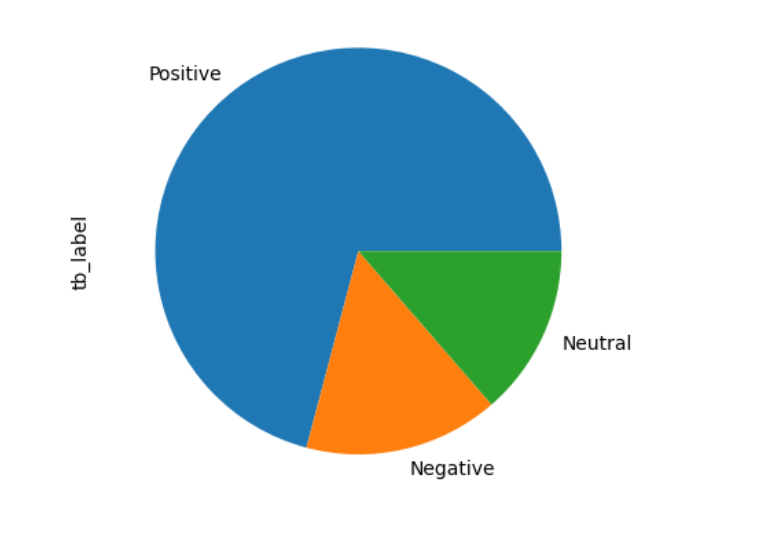
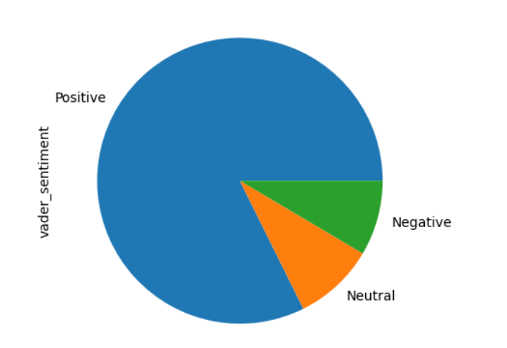
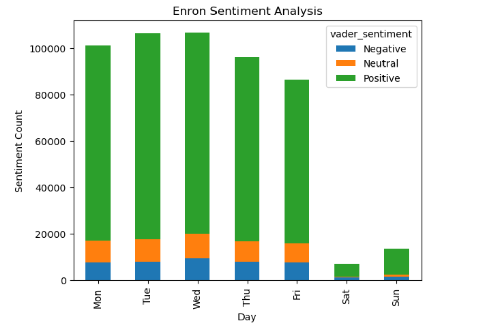
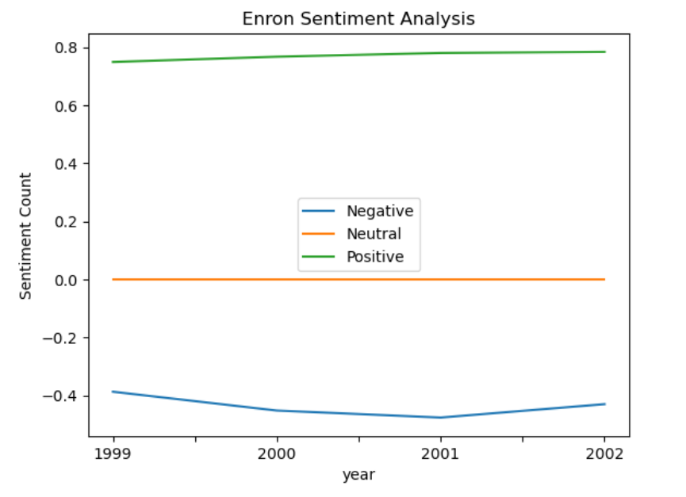
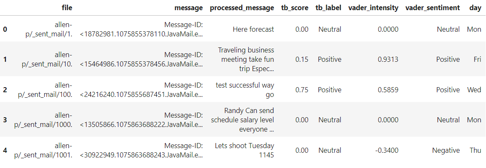

# Sentiment_analysis_using_Enron
The Enron email dataset from 2015 is a rich source of data for various data science and machine learning projects. We are performing sentiment analysis of Enron emails to analyze the sentiment or tone of the emails.

Here are some of the insights I gained through visualizations after analysis, we can acheive more insights as per the requirement
situation

How Textblob performed: If we see the following pie chart, it shows a good amount of positive content but still there is a lot of negative and neutral content so we can try to maximize the positive attitude of the employees using different strategies as per organizations standards and policies.

How Vader performed: Vader shows there is a lot of positivity among the employees than the Textblob and this could be because Vader uses vader lexicon and is optimized mainly for social media, Since Emails are not a proper feedback from the employees they are close to how people interact in a social media with professionalism. So Vader could perform a little better in this scenario.

Does the day of the work affect how an employee works? To analyze it following is the sentiment over the week but there is not much difference.

How does the sentiment of the employees varied over the years as the organization expands or progresses

I have analyzed the sentiment of the email and gained insights using visualizations. This still can be continued with advanced
analysis as defined below.

Here's an outline of the steps one could follow:

Step 1: Data Preparation (load_data.py file contains the code for this)

Obtain the Enron email dataset from 2015, which typically comes in a compressed format such as a tar file.
Extract the dataset using appropriate software or libraries.
Load the emails into a suitable data structure, such as a pandas DataFrame, for further processing.

Step 2: Data Cleaning and Preprocessing (preprocessing.py and enron-sentiment-analysis.ipynb both files contain the code)

Perform data cleaning tasks such as removing unnecessary headers, footers, and other irrelevant information from the emails.
Handle missing values, if any, using appropriate techniques.
Preprocess the text data by removing punctuation, special characters, and converting text to lowercase.
Perform tokenization, stopword removal, and lemmatization to convert the text data into a more structured format that can be
used for analysis.

Step 3: Sentiment Analysis (analysis.py contains the sentiment analysis and enron-sentiment-analysis.ipynb contains both
analysis and visualizations)

Use natural language processing (NLP) techniques, such as sentiment analysis libraries like NLTK, TextBlob, or VADER, to
analyze the sentiment of the emails.
Apply sentiment analysis methods to determine the overall sentiment (positive, negative, or neutral) of the emails or
individual email messages.
Visualize the sentiment analysis results using appropriate plots or charts to gain insights into the overall sentiment
patterns in the Enron emails.

Following is the sample data I had after performing the analysis:

****************************************************************************************************************************
Advanced Analysis

Conduct deeper analysis, such as identifying key topics or themes in the emails using topic modeling techniques like
Latent Dirichlet Allocation (LDA) or Non-negative Matrix Factorization (NMF).
Perform exploratory data analysis (EDA) to gain additional insights into the Enron emails, such as identifying frequently
used words or phrases, common email patterns, or sender-receiver relationships.
Utilize machine learning algorithms, such as classification or clustering, to identify specific types of emails, such as
spam or fraudulent emails, based on the content and sentiment.
